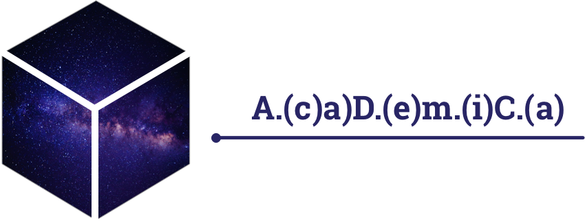
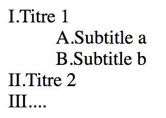
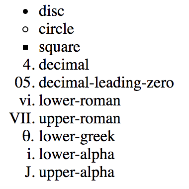

# A.(c)a)D.(e)m.(i)C.(a) - CSS custom counters with SASS magic
[](https://github.com/iStuffs/academica/releases/latest)
[](https://www.npmjs.com/package/academica)
[](https://www.npmjs.com/package/academica)
## How to use it right out the box

Add `academica.css` stylesheet to your head

```
<link rel="stylesheet" href="css/academica.css">
```

Add the class `academica` to your `ol`

```
<ol class="academica">
  <li>Titre 1
    <ol class="academica">
      <li>Subtitle a</li>
      <li>Subtitle b</li>
    </ol>
  </li>
  <li>Titre 2</li>
  <li>...</li>
</ol>
```

the code above will render as:



**And *‘voila’*, it's simply works.**<br>
You can go beyond and personalize the counters, see configuration to know more.<br>
Or Inspect the [demo page](https://istuffs.github.io/academica/) to figure out more.

## Configuration

### Variables

You can override the default css variables before importing the variables

```scss
//The class used on the first ol. ('.academica' is the default value)
$class: '.my-awesome-list';

//Separator for simple list. ("." is the default value)
$main-separator: ".";

//Do you want counter on your headings (Hn)? (true is the default value)
$headings-counter: true;

//Indentation for headings. (10px is the default value)
$headings-indent: 1.5em;

//Do you want counter on your organized lists (OLs). (true is the default value)
$list-counter: true;

@import 'academica.variables';
```


### Simple theming

For simple counters just use as many css's list-style-type as needed.

```
$counters: upper-roman, upper-alpha, decimal, lower-alpha, decimal, lower-alpha, lower-roman;
```

Available list-style-type:



<!-- <ol>
  <li style="list-style-type:disc">disc</li>
  <li style="list-style-type:circle">circle</li>
  <li style="list-style-type:square">square</li>
  <li style="list-style-type:decimal">decimal</li>
  <li style="list-style-type:decimal-leading-zero">decimal-leading-zero</li>
  <li style="list-style-type:lower-roman">lower-roman</li>
  <li style="list-style-type:upper-roman">upper-roman</li>
  <li style="list-style-type:lower-greek">lower-greek</li>
  <li style="list-style-type:lower-alpha">lower-alpha</li>
  <li style="list-style-type:upper-alpha">upper-alpha</li>
</ol> -->

Separator for simple list

```
$main-separator: ")";
```

### Advanced theming

**Unleash the power of academica with themes**: Import the default harvard theme or create yours.

```
@import 'academica.harvard.theme';
```

for more configuration use this type of configuration

```
 $counters: (
   (pre-counter: "",  counter-style: 'upper-roman', separator: "."), //  I.
   (pre-counter: "",  counter-style: 'upper-alpha', separator: "."), //  A.
   (pre-counter: "",  counter-style: 'decimal',     separator: "."), //  1.
   (pre-counter: "",  counter-style: 'lower-alpha', separator: "."), //  a.
   (pre-counter: "",  counter-style: 'decimal',     separator: ")"), //  1)
   (pre-counter: "(", counter-style: 'lower-alpha', separator: ")"), // (a)
   (pre-counter: "(", counter-style: 'lower-roman', separator: ")")  // (i)
 );
```
